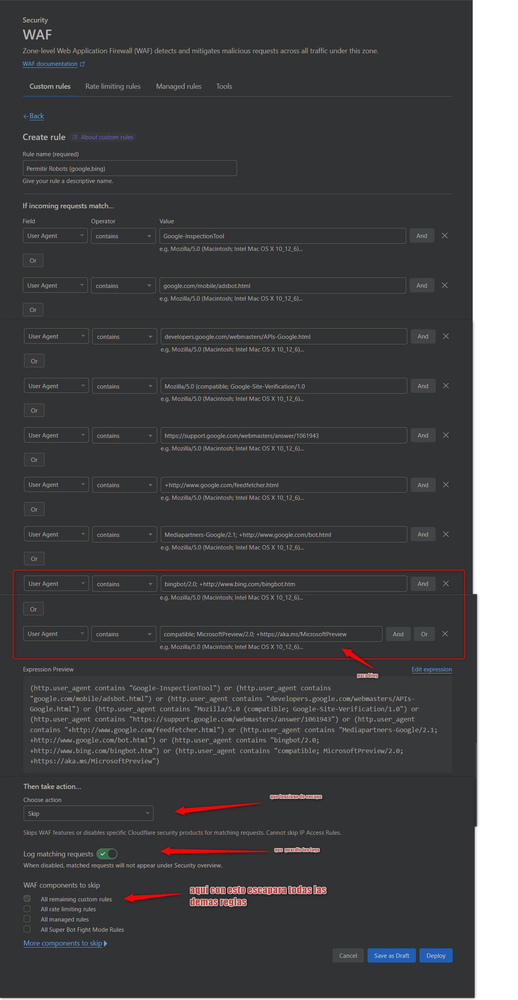

### Reglas CloudFlare evitar bots en la Paginas Webs

---


-- --------------------------


# Google Bot (Google crawlers)
https://developers.google.com/search/docs/crawling-indexing/overview-google-crawlers#google-inspectiontool


Asi quedaria la regla


-- --------------------------


Aqui vermos el contenido del primero




-- --------------------------


Este es la expresion que contiene

### Permitir Rastreador Robot (Google y Bing)
```shell
(http.user_agent contains "Google-InspectionTool") or (http.user_agent contains "google.com/mobile/adsbot.html") or (http.user_agent contains "developers.google.com/webmasters/APIs-Google.html") or (http.user_agent contains "Mozilla/5.0 (compatible; Google-Site-Verification/1.0") or (http.user_agent contains "https://support.google.com/webmasters/answer/1061943") or (http.user_agent contains "+http://www.google.com/feedfetcher.html") or (http.user_agent contains "Mediapartners-Google/2.1; +http://www.google.com/bot.html") or (http.user_agent contains "bingbot/2.0; +http://www.bing.com/bingbot.htm") or (http.user_agent contains "compatible; MicrosoftPreview/2.0; +https://aka.ms/MicrosoftPreview")```
```
---


# Bing Bot (Bing crawlers)
https://www.bing.com/webmasters/help/which-crawlers-does-bing-use-8c184ec0


[//]: # (-------------------------------------------------------------------&#41;)
[//]: # (-------------------------------------------------------------------&#41;)
[//]: # (-------------------------------------------------------------------&#41;)


# Otra forma de filtro y bloqueo es por ASN

https://ipinfo.io/AS15169#block-ranges


-- --------------------------


ver los `ASN`


-- --------------------------
