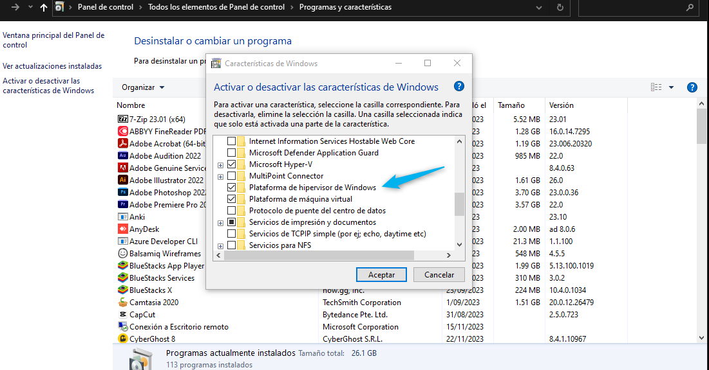

# instalacion qemu windows

https://qemu.weilnetz.de/w64/


-- --------------------------
## agregar path a  windows

```shell
C:\Program Files\qemu
```


##### Activar Hypervisor de Windows




-- --------------------------
## comando para crear 

```shell
qemu-system-x86_64 -m 2G -boot d -cdrom D:\windows\isos\ubuntu-22.04.1-live-server-amd64.iso
```


-- --------------------------


# Creacion de Maquina Virtual

[//]: # (--------------------------1. Creacion de disco ---------------------------)
### 1. Creacion de disco

- mas infor: https://computingforgeeks.com/working-with-qemu-img/

#### Crear disco
```shell
qemu-img create -f qcow2 F:\virtuales_Qemu\ubuntu\disco-ubuntu.qcow2 40G
# ver info de disco

```
##### Opciones de imagen disco
- ver informacion del disco
    ```shell
    qemu-img info F:\virtuales_Qemu\ubuntu\disco-ubuntu.qcow2
    # output: 
    #   image: F:\virtuales_Qemu\ubuntu\disco-ubuntu.qcow2
    #   file format: qcow2
    #   virtual size: 40 GiB (42949672960 bytes)
    #   disk size: 193 KiB
    #   cluster_size: 65536
    #   Format specific information:
    #       compat: 1.1
    #       compression type: zlib
    #       lazy refcounts: false
    #       refcount bits: 16
    #       corrupt: false
    #       extended l2: false
    #   Child node '/file':
    #       filename: F:\virtuales_Qemu\ubuntu\disco-ubuntu.qcow2
    #       protocol type: file
    #       file length: 193 KiB (197632 bytes)
    #       disk size: 193 KiB
    ```


- reemplazar typo de formato de imagen
    ```shell
    # :::::::::::: convertir un tipo qcow2 a vmdk
    #:::::: to vmdk  (ojo aqui si el archivo pesara lo que tenga en GB)
    qemu-img convert -O vmdk  F:\virtuales_Qemu\ubuntu\disco-ubuntu.qcow2 F:\virtuales_Qemu\ubuntu\disco-ubuntu.vmdk
    #:::::: to RAW  (ojo aqui si el archivo pesara lo que tenga en GB)
    #qemu-img convert -O raw  F:\virtuales_Qemu\ubuntu\disco-ubuntu.qcow2 F:\virtuales_Qemu\ubuntu\disco-ubuntu.raw
    
    #:::: ver info de disco
    #  qemu-img info F:\virtuales_Qemu\ubuntu\disco-ubuntu.vmdk
    
    # 😆 aqui regresamos al formato anterior
    qemu-img convert -O qcow2  F:\virtuales_Qemu\ubuntu\disco-ubuntu.vmdk F:\virtuales_Qemu\ubuntu\disco-ubuntu.qcow2

    ```
- revisar estado de disco
    ```shell
    qemu-img check F:\virtuales_Qemu\ubuntu\disco-ubuntu.vmdk
    ```
- **Incrementar  espacio de disco Typos NO admitidos (vmdk)**

  _ojo no se puede decrementar espacio_
    ```shell
    # ::: para qcow2   
    qemu-img resize F:\virtuales_Qemu\ubuntu\disco-ubuntu.qcow2 +10G

    # ::: para format RAW
    # qemu-img resize -f raw  F:\virtuales_Qemu\ubuntu\disco-ubuntu.raw +10G
    #:::: ver info de disco
    #  qemu-img info F:\virtuales_Qemu\ubuntu\disco-ubuntu.qcow2
    ```

[//]: # (--------------------------1. Creacion de disco ---------------------------)
### 2. Creacion de de Maquina

crear disco

Disco duro virtual “myVirtualDisk.qcow2“, creado previamente

4 GB de RAM
2 CPU
Disco duro que  creamos
Arranque desde el archivo ISO “linuxmint-21.1-cinnamon-64bit.iso“
Tarjeta de red conectada al host a través de NAT
Tarjeta de video de alta resolución
Tarjeta de sonido
Ratón y teclado

```shell
qemu-system-x86_64 \
-enable-kvm                                                    \
-m 4G                                                          \
-smp 2                                                         \
-hda F:\virtuales_Qemu\ubuntu\disco-ubuntu.qcow2               \
-boot d                                                        \
-cdrom D:\windows\isos\ubuntu-22.04.1-live-server-amd64.iso    \
-netdev user,id=net0,net=192.168.0.0/24,dhcpstart=192.168.0.19  \
-device virtio-net-pci,netdev=net0                             \
-vga qxl                                                       \
-device AC97
```

```powershell
qemu-system-x86_64 -m 4G -smp 2 -L "C:\Program Files\qemu" -boot menu=on -hda "F:\virtuales_Qemu\ubuntu\disco-ubuntu.qcow2" -cdrom "D:\windows\isos\ubuntu-20.04.1-desktop-amd64.iso"
qemu-system-x86_64 -m 4G -smp 2 -L "C:\Program Files\qemu" -boot menu=on -hda "F:\virtuales_Qemu\ubuntu\disco-ubuntu.qcow2" 


qemu-system-x86_64 -m 4G -smp 2 -hda F:\virtuales_Qemu\ubuntu\disco-ubuntu.qcow2 -boot d -cdrom D:\windows\isos\ubuntu-22.04.1-live-server-amd64.iso -netdev user,id=net0,net=192.168.0.0/24,dhcpstart=192.168.0.19 -device virtio-net-pci,netdev=net0 -vga qxl -device AC97
```

```powershell
qemu-system-x86_64 -m 4G -smp 2 -hda F:\virtuales_Qemu\ubuntu\disco-ubuntu.qcow2 -vga qxl -device AC97
```


# aceleracion con qemu en windows
https://www.qemu.org/2017/11/22/haxm-usage-windows/
```shell
qemu-system-x86_64 -m 2G -cdrom D:\windows\isos\ubuntu-22.04.1-live-server-amd64.iso
```
